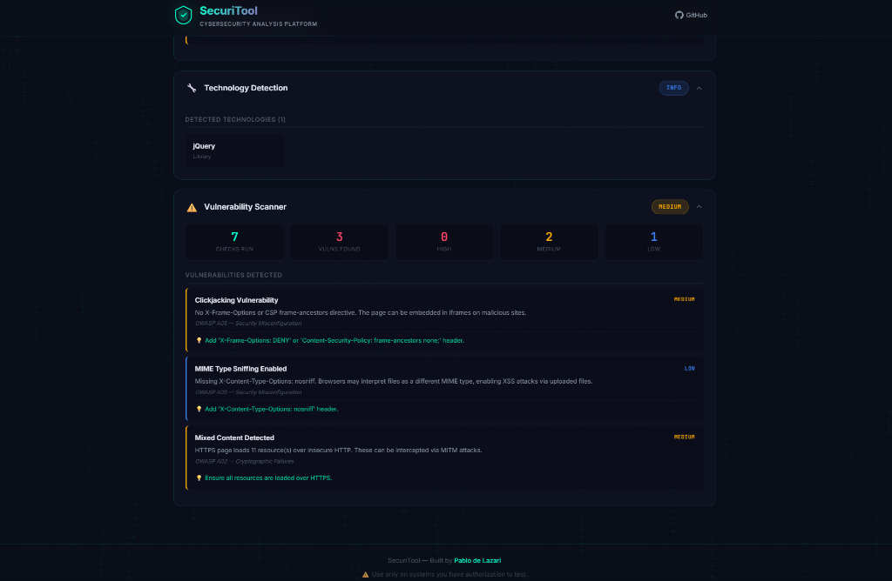

# 🛡️ SecuriTool — Cybersecurity Analysis Platform

<div align="center">

**A professional web-based security assessment tool for reconnaissance and vulnerability analysis.**

[](https://python.org)
[](https://flask.palletsprojects.com)
[](LICENSE)

</div>

---

## 📖 About

SecuriTool is a modular cybersecurity analysis platform built with **Python/Flask** and a modern **cyberpunk-themed web UI**. It performs real-world security assessments including port scanning, HTTP header analysis, SSL/TLS inspection, DNS enumeration, technology fingerprinting, and OWASP-aligned vulnerability detection.

> ⚠️ **Disclaimer:** Use this tool only on systems you own or have explicit authorization to test. Unauthorized scanning may violate laws in your jurisdiction.

### 🖥️ Scan Results Preview

<div align="center">

</div>

---

## ⚙️ Features

| Module | Description | Key Checks |
|--------|-------------|------------|
| 🔌 **Port Scanner** | TCP connect scan with service detection | Top 100/1000 ports, banner grabbing, risk assessment |
| 🛡️ **Security Headers** | OWASP-recommended header analysis | HSTS, CSP, X-Frame-Options, CORP, Referrer-Policy + grading (A+ to F) |
| 🔒 **SSL/TLS Analysis** | Certificate and cipher inspection | Cert validity, expiry, TLS version, cipher strength, chain verification |
| 🌐 **DNS Enumeration** | Record queries and subdomain discovery | A, AAAA, MX, NS, TXT, CNAME, SOA records + 80 common subdomains |
| 🔧 **Tech Detection** | Server and framework fingerprinting | CMS detection, cookie security flags, version disclosure |
| ⚠️ **Vuln Scanner** | OWASP Top 10 misconfiguration checks | Clickjacking, MIME sniffing, mixed content, open redirects, HTTPS enforcement |

---

## 🚀 Quick Start

### Prerequisites

- Python 3.9 or higher
- pip (Python package manager)

### Installation

```bash
# Clone the repository
git clone https://github.com/pablodelazari/cybersecurity_tool.git
cd cybersecurity_tool

# Install dependencies
pip install -r requirements.txt

# Run the application
python app.py
```

Then open your browser at **<http://localhost:5000>** 🚀

---

## 🏗️ Architecture

```
securi tool/
├── app.py                  # Flask server + REST API
├── requirements.txt        # Python dependencies
├── scanners/
│   ├── port_scanner.py     # TCP port scanning + banner grab
│   ├── header_scanner.py   # HTTP security headers analysis
│   ├── ssl_scanner.py      # SSL/TLS certificate analysis
│   ├── dns_scanner.py      # DNS enumeration + subdomain discovery
│   ├── tech_detector.py    # Technology fingerprinting
│   └── vuln_scanner.py     # OWASP vulnerability checks
├── templates/
│   └── index.html          # Dashboard UI
└── static/
    ├── css/style.css       # Cyberpunk dark theme
    └── js/app.js           # Frontend logic
```

### API Endpoints

| Method | Endpoint | Description |
|--------|----------|-------------|
| `POST` | `/api/scan` | Start a new scan (body: `{target, modules}`) |
| `GET` | `/api/scan/<id>` | Get scan status and results |
| `GET` | `/api/scan/<id>/module/<name>` | Get specific module results |

---

## 🔒 Security References

This tool implements checks aligned with:

- [OWASP Secure Headers Project](https://owasp.org/www-project-secure-headers/)
- [OWASP Top 10 (2021)](https://owasp.org/www-project-top-ten/)
- [Mozilla Observatory](https://observatory.mozilla.org/)
- [SSL Labs Grading](https://www.ssllabs.com/ssltest/)

---

## 👤 Author

**Pablo de Lazari** — Aspiring Cybersecurity Professional

- GitHub: [@pablodelazari](https://github.com/pablodelazari)

---

## 📄 License

This project is licensed under the MIT License — see [LICENSE](LICENSE) for details.
